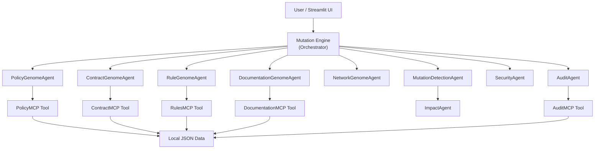

# DecisionDNA AI

> **Temporal Decision Forensics for Healthcare Networks**

DecisionDNA AI is a temporal decision forensics platform for healthcare networks. It reconstructs why healthcare decisions change over time by tracing the decision's "DNA": policy lineage, contract lineage, business rule lineage, documentation lineage, network lineage, and evidence lineage.

---

## Problem Statement

Healthcare payer organizations, insurance companies, provider networks, claims teams, and compliance teams often struggle to answer:

- "Why was this approved before but denied now?"
- "Why was this provider active before but terminated now?"
- "Why was this claim paid before but rejected now?"
- "Which policy, contract, rule, or documentation change caused the decision drift?"

These questions arise constantly in prior authorization, claims adjudication, and provider network management — and answering them today requires hours of manual cross-referencing across siloed systems.

## Why This Is Different

DecisionDNA AI is **not** a generic chatbot, not a generic AI explainability tool, and not a simple audit logger.

It is different because it reconstructs healthcare **decision lineage** through a **genome/mutation model**:

| Question | DecisionDNA Answers It With |
|---|---|
| What decision was made then? | Old Decision Genome snapshot |
| What decision is made now? | New Decision Genome snapshot |
| Which decision genes changed? | Gene-by-gene mutation detection |
| Which mutation caused the outcome drift? | Primary/secondary mutation ranking |
| Is the decision defensible? | Confidence score + evidence analysis |
| Is human review required? | Automated risk/review flag |

## Why Agents Are Needed

Each "gene" of a decision requires **domain-specific reasoning**:

- **PolicyGenomeAgent** must understand policy clause structures and versioning
- **ContractGenomeAgent** must understand provider contracts, network enrollment, and termination logic
- **RuleGenomeAgent** must compare validation check sets across rule versions
- **DocumentationGenomeAgent** must perform gap analysis between required and submitted evidence
- **NetworkGenomeAgent** must track provider network participation changes
- **MutationDetectionAgent** must aggregate all findings and determine root cause
- **ImpactAgent** must estimate downstream business impact
- **SecurityAgent** must scan for prompt injection, PII, and unsafe instructions
- **AuditAgent** must generate a compliant executive audit report

A single monolithic function cannot handle this complexity. Each agent encapsulates domain expertise and uses MCP-style tools to access external data.

## Architecture



## Demo Cases

### Case 1: MRI Prior Authorization Decision Drift
- **January:** APPROVED under MRI-MED-NEC-v1
- **June:** DENIED under MRI-MED-NEC-v2
- **Root cause:** Policy Gene mutation (specialist review now required) + Documentation Gene mutation (specialist review not submitted)

### Case 2: Claim Payment Decision Drift
- **February:** PAID — provider in-network, rules satisfied
- **June:** REJECTED — provider out-of-network, referral ID required but missing
- **Root cause:** Contract Gene mutation + Rule Gene mutation + Network Gene mutation

### Case 3: Provider Network / Contract Decision Drift
- **March:** ACTIVE / IN_NETWORK
- **June:** TERMINATED / OUT_OF_NETWORK
- **Root cause:** Contract Gene mutation (network restructured, contract not renewed)

## MCP-Style Tool Layer

| Tool | Purpose | Data Source |
|---|---|---|
| PolicyMCP | Fetch/compare policy versions and clauses | `policy_versions.json` |
| ContractMCP | Fetch/compare provider contracts and network status | `contract_versions.json` |
| RulesMCP | Fetch/compare business rule versions and validations | `rule_versions.json` |
| DocumentationMCP | Fetch required/submitted docs and compute gaps | `documentation_requirements.json` |
| AuditMCP | Generate and store audit trail records | In-memory store |

## Security Features

- **Prompt injection detector** — catches "ignore previous instructions", "bypass policy", etc.
- **PII pattern detector** — flags SSN, email, phone, member ID patterns
- **Unsafe instruction detector** — blocks "delete records", "reveal api key", "disable audit"
- **Input sanitization** — redacts detected PII before downstream processing
- **No real PHI** — all data is synthetic

## Agent Skills

| Skill | Description |
|---|---|
| `build_decision_genome()` | Load a Decision Genome from snapshot data |
| `compare_genomes()` | Gene-by-gene diff of two genomes |
| `detect_mutations()` | Run all genome agents and return mutations |
| `calculate_mutation_score()` | Aggregate mutations into scored report |
| `generate_temporal_timeline()` | Build the decision timeline |
| `generate_audit_report()` | Produce executive audit report |
| `scan_security_risks()` | Run security scan on text input |

## Setup Instructions

```bash
# 1. Clone the repository
git clone https://github.com/YOUR_USERNAME/decision-dna-ai.git
cd decision-dna-ai

# 2. Create virtual environment (optional but recommended)
python -m venv .venv
source .venv/bin/activate  # or .venv\Scripts\activate on Windows

# 3. Install dependencies
pip install -r requirements.txt

# 4. (Optional) Generate project signature
cp .env.example .env
# Edit .env with your name/handle
python scripts/generate_project_signature.py
```

## How to Run Locally

```bash
# Run the Streamlit app
streamlit run app.py

# Or run the notebook demo
python notebooks/decision_dna_ai_demo.py
```

The app opens at `http://localhost:8501` with all three demo cases loaded.

## Kaggle Submission Notes

1. Upload the repo as a Kaggle dataset or clone from GitHub
2. The notebook demo at `notebooks/decision_dna_ai_demo.py` can be pasted cell-by-cell into a Kaggle notebook
3. No API keys required — runs fully with synthetic data
4. Track: **Agents for Business**

## Antigravity Usage

This project was built with assistance from **Antigravity**, Google's agentic AI coding assistant:

- **Architecture design** — agent responsibilities, MCP tool layer design
- **Code generation** — Pydantic models, agent implementations, Streamlit UI
- **Iteration** — self-review for import errors, schema consistency, UI rendering
- **Documentation** — README, Kaggle writeup, video script

See `docs/antigravity_usage.md` for detailed usage documentation.

## Originality and Differentiation

DecisionDNA AI is **not** a generic chatbot or generic AI observability tool.

It is original because:
- **Decision Genome metaphor** — models every healthcare decision as a DNA fingerprint with specific genes
- **Temporal forensics** — compares decision snapshots over time, not just current state
- **Multi-agent architecture** — nine specialized agents with domain expertise
- **Healthcare domain depth** — uses real-world concepts (prior auth, claims adjudication, provider networks, credentialing, continuity of care)
- **MCP-style tool layer** — structured external data access with logging
- **Security-first** — prompt injection, PII detection, unsafe instruction scanning built in
- **Reproducible** — deterministic outputs, synthetic data, no external dependencies

## Limitations

- Uses synthetic data only — not connected to real healthcare systems
- Mock MCP tools read from local JSON — no real API calls
- Security scanner uses pattern matching — not a production-grade WAF
- Impact estimates are heuristic — not based on real actuarial data
- Single-machine demo — not horizontally scalable

## Future Improvements

- Connect to real policy management / claims adjudication APIs via production MCP
- Add Gemini/ADK integration for natural language root cause explanations
- Implement real-time decision monitoring with streaming genome comparison
- Add role-based access control for compliance teams vs. clinical reviewers
- Integrate with FHIR-based clinical data sources
- Add multi-tenant support for different payer organizations

---

**Built by Sharath Chandra** · Synthetic Demo Only · No PHI

🧬 DecisionDNA AI — Temporal Decision Forensics for Healthcare Networks
