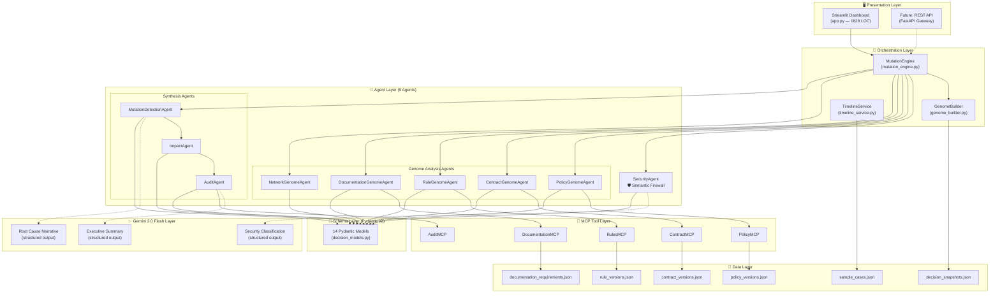
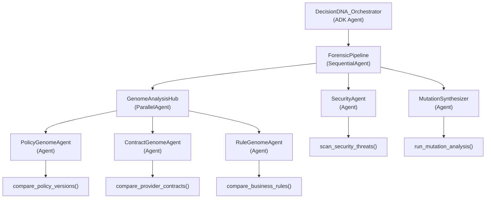
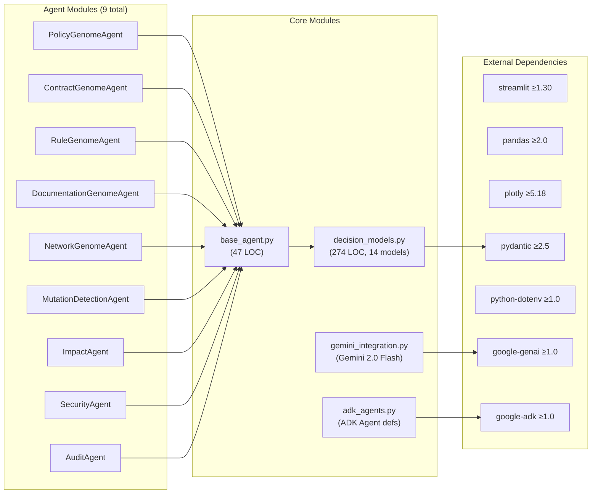
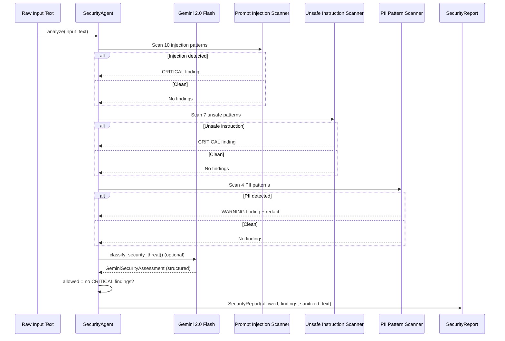

# Architecture — DecisionDNA AI

> Multi-Agent Temporal Decision Forensics Platform for Healthcare Networks

## System Architecture Overview



## ADK Agent Hierarchy



## Component Dependency Graph



## Data Flow Sequence

```mermaid
sequenceDiagram
    participant U as User/UI
    participant ME as MutationEngine
    participant SA as SecurityAgent
    participant GB as GenomeBuilder
    participant PA as PolicyGenomeAgent
    participant CA as ContractGenomeAgent
    participant RA as RuleGenomeAgent
    participant DA as DocGenomeAgent
    participant NA as NetworkGenomeAgent
    participant MDA as MutationDetectionAgent
    participant GM as Gemini 2.0 Flash
    participant IA as ImpactAgent
    participant AA as AuditAgent
    participant MCP as MCP Tools

    U->>ME: run_full_analysis(case_id)
    
    rect rgb(15, 23, 42)
        Note over ME,GB: Phase 1: Genome Hydration
        ME->>GB: get_genome_pair(case_id)
        GB->>MCP: Load decision_snapshots.json
        MCP-->>GB: Raw snapshot data
        GB->>GB: DecisionGenome.model_validate()
        GB-->>ME: (old_genome, new_genome)
    end

    rect rgb(88, 28, 135)
        Note over ME,NA: Phase 2: Gene Mutation Detection
        ME->>PA: analyze(old_genome, new_genome)
        PA->>MCP: PolicyMCP.compare_policy_versions()
        MCP-->>PA: clause_diff
        PA-->>ME: GeneMutation(policy)

        ME->>CA: analyze(old_genome, new_genome)
        CA->>MCP: ContractMCP.compare_contracts()
        MCP-->>CA: contract_diff
        CA-->>ME: GeneMutation(contract)

        ME->>RA: analyze(old_genome, new_genome)
        RA->>MCP: RulesMCP.compare_rules()
        MCP-->>RA: rule_diff
        RA-->>ME: GeneMutation(rule)

        ME->>DA: analyze(old_genome, new_genome)
        DA-->>ME: GeneMutation(documentation)

        ME->>NA: analyze(old_genome, new_genome)
        NA-->>ME: GeneMutation(network)
    end

    rect rgb(124, 45, 18)
        Note over ME,AA: Phase 3: Forensic Synthesis
        ME->>MDA: analyze(old, new, gene_mutations)
        MDA->>MDA: Calculate weighted mutation score
        MDA->>MDA: Determine primary/secondary mutations
        MDA->>MDA: compute_genome_hash()
        MDA-->>ME: MutationReport

        ME->>GM: generate_root_cause_narrative()
        GM-->>ME: GeminiRootCauseAnalysis (structured)

        ME->>IA: analyze(mutation_report)
        IA->>IA: Estimate population impact
        IA->>IA: Calculate financial exposure
        IA-->>ME: ImpactAssessment

        ME->>SA: analyze(input_text)
        SA->>SA: Regex: prompt injection + PII scan
        SA-->>ME: SecurityReport

        ME->>AA: analyze(mutation, impact, security)
        AA->>MCP: AuditMCP.store_audit_record()
        AA-->>ME: AuditReport

        ME->>GM: generate_executive_summary()
        GM-->>ME: GeminiExecutiveSummary (structured)
    end

    ME-->>U: Complete Analysis Result
```



## Security Agent Scanning Sequence



## Directory Structure

```
decision-dna-ai/
├── app.py                          # Streamlit UI (1828 LOC)
├── requirements.txt                # Dependencies (incl. google-genai, google-adk)
├── Dockerfile                      # Container build
├── pyproject.toml                  # Project config + linting
├── README.md                       # Comprehensive documentation
├── SECURITY.md                     # Threat model & security policy
├── CONTRIBUTING.md                 # Contribution guide
├── LICENSE                         # MIT License
├── .env.example                    # Environment template
├── docs/                           # Extended documentation
│   ├── ARCHITECTURE.md             # This file
│   ├── AGENTS.md                   # Agent registry & design
│   ├── EVALUATION.md               # Eval framework
│   ├── DEPLOYMENT.md               # Deployment guide
│   └── PRODUCTION.md               # Production readiness
├── src/
│   ├── agents/                     # 9 AI agents + Gemini + ADK
│   │   ├── base_agent.py           # ABC for all agents
│   │   ├── gemini_integration.py   # Gemini 2.0 Flash (google-genai)
│   │   ├── adk_agents.py           # ADK agent definitions
│   │   ├── policy_genome_agent.py
│   │   ├── contract_genome_agent.py
│   │   ├── rule_genome_agent.py
│   │   ├── documentation_genome_agent.py
│   │   ├── network_genome_agent.py
│   │   ├── mutation_detection_agent.py
│   │   ├── impact_agent.py
│   │   ├── security_agent.py
│   │   └── audit_agent.py
│   ├── models/
│   │   └── decision_models.py      # 14 Pydantic v2 models
│   ├── services/
│   │   ├── mutation_engine.py      # Pipeline orchestrator + Gemini
│   │   ├── genome_builder.py       # Genome hydration
│   │   └── timeline_service.py     # Temporal event builder
│   ├── tools/                      # 5 MCP tool servers
│   │   ├── policy_mcp.py
│   │   ├── contract_mcp.py
│   │   ├── rules_mcp.py
│   │   ├── documentation_mcp.py
│   │   └── audit_mcp.py
│   ├── data/                       # Synthetic healthcare data
│   └── utils/
│       └── formatting.py           # UI formatting helpers
├── tests/
│   └── test_genome_forensics.py    # 4 test classes
├── scripts/
│   └── generate_project_signature.py
└── .github/workflows/
    └── deploy.yml                  # CI/CD pipeline
```
