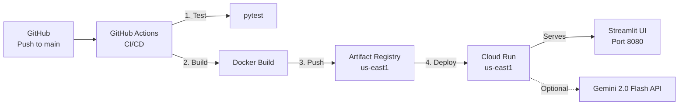

# Deployment Guide — DecisionDNA AI

## Deployment Targets

### 1. Local Development (Recommended for Judges)

```bash
# Clone the repository
git clone https://github.com/sharath559/decision-dna-ai.git
cd decision-dna-ai

# Create virtual environment
python -m venv .venv && source .venv/bin/activate

# Install dependencies
pip install -r requirements.txt

# (Optional) Configure Gemini API key for LLM features
cp .env.example .env
# Edit .env and add your GOOGLE_API_KEY from https://aistudio.google.com/apikey

# Run the application
streamlit run app.py
```

App opens at `http://localhost:8501`.

> **Note:** The app runs fully in **MOCK_MODE** without a Gemini API key. All agent logic, mutation scoring, security scanning, and audit reports work without any external dependencies.

---

### 2. Docker (Local Container)

```bash
# Build the image
docker build -t decision-dna-ai .

# Run the container
docker run -p 8080:8080 decision-dna-ai

# With Gemini API key
docker run -p 8080:8080 -e GOOGLE_API_KEY="your-key" decision-dna-ai
```

App available at `http://localhost:8080`.

---

### 3. Google Cloud Run (Production)

#### Prerequisites
- Google Cloud project with billing enabled
- `gcloud` CLI installed and authenticated
- Artifact Registry repository created

#### Manual Deployment

```bash
# Authenticate
gcloud auth login
gcloud config set project YOUR_PROJECT_ID

# Build and push to Artifact Registry
IMAGE="us-east1-docker.pkg.dev/YOUR_PROJECT_ID/decision-dna-repo/decision-dna-ai:latest"
docker build -t $IMAGE .
docker push $IMAGE

# Deploy to Cloud Run
gcloud run deploy decision-dna-ai \
  --image $IMAGE \
  --region us-east1 \
  --allow-unauthenticated \
  --port 8080 \
  --memory 1Gi \
  --cpu 1 \
  --set-env-vars MOCK_MODE=true
```

#### CI/CD Automated Deployment

The GitHub Actions workflow at `.github/workflows/deploy.yml` automatically:

1. ✅ Runs unit tests on every push/PR to `main`
2. 🐳 Builds Docker image on test success
3. 📦 Pushes to Google Artifact Registry
4. 🚀 Deploys to Cloud Run

**Required GitHub Secrets:**

| Secret | Description |
|--------|-------------|
| `GCP_SA_KEY` | Service account JSON key with Cloud Run Admin + Artifact Registry Writer |
| `GCP_PROJECT_ID` | Google Cloud project ID |
| `GOOGLE_API_KEY` | (Optional) Gemini API key for LLM features |

---

## Environment Variables

| Variable | Default | Description |
|----------|---------|-------------|
| `PROJECT_OWNER` | `Sharath Chandra` | Author name for cryptographic signature |
| `PROJECT_HANDLE` | `@yakarasharath4` | Author handle for verification |
| `MOCK_MODE` | `true` | Run with synthetic data (no external APIs) |
| `PRIVATE_DEMO_MODE` | `false` | Enable personalised fingerprints |
| `GOOGLE_API_KEY` | (empty) | Google AI Studio API key for Gemini 2.0 Flash |
| `GOOGLE_GENAI_USE_VERTEXAI` | `false` | Use Vertex AI instead of AI Studio |
| `GOOGLE_CLOUD_PROJECT` | (empty) | GCP project for Vertex AI |
| `GOOGLE_CLOUD_LOCATION` | `us-central1` | GCP region for Vertex AI |

---

## Deployment Architecture



## Monitoring & Health

| Check | How |
|-------|-----|
| Application health | Cloud Run health checks on `/` |
| Deployment logs | `gcloud run services logs read decision-dna-ai` |
| Gemini API status | Check `gemini_integration.py` logs for `Gemini: Client initialised` |
| Audit trail | In-memory for demo; Cloud SQL in production |
